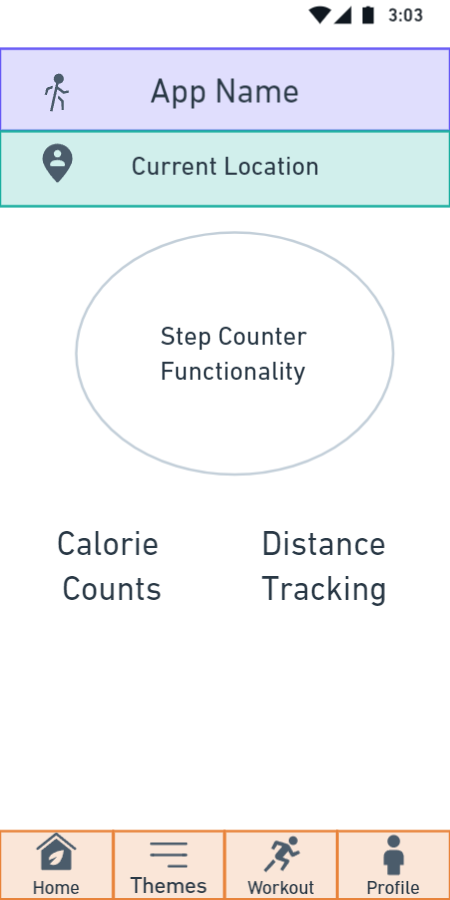

# WalkTopia_HackVita2023

## Table of Contents

- [About](#about)
- [Installation](#installation)
- [Usage](#usage)
- [Contributing](#contributing)
- [License](#license)

### Homepage Wireframe Lofi Design 

This is a description of my awesome Android app. It does all sorts of cool things and is designed to make your life easier. Here are some of the key features:

- Feature 1
- Feature 2
- Feature 3

## Requirements

- Android 6.0 or later
- Internet connection

## Installation

1. Clone this repository
2. Open the project in Android Studio
3. Build and run the app on your device or emulator

## Version History

### Version 1.0.0

- Initial release

### Version 1.1.0

- Added feature 3
- Bug fixes

## Contributing

Contributions are welcome! If you'd like to contribute to the project, please follow these steps:

1. Fork this repository
2. Create a branch for your feature or bug fix
3. Make your changes and commit them
4. Push your changes to your fork
5. Submit a pull request

## License

This project is licensed under the [MIT License](/LICENSE).
