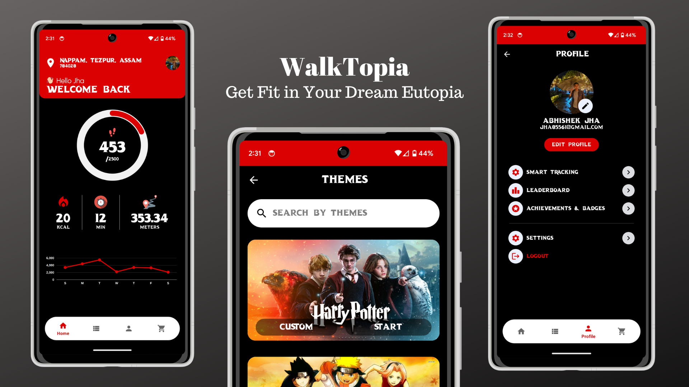

o# WalkTopia_HackVita2023

## Table of Contents

- [About](#about)
- [Installation](#installation)
- [Usage](#usage)
- [Contributing](#contributing)
- [License](#license)

# About

The app is a fitness tracker that gamifies exercise by incorporating theme-based UI catering to nostalgic sentiments of users. Users can choose from a range of themes like Harry Potter or the Roman Empire, and enjoy rewards and points for exercising with friends. It also includes a multiplayer and leaderboard function and a marketplace for merchandise. Users can embark on adventures while exercising, like being Captain Jack Sparrow or Iron Man. Here are some of the key features:

- Fitness
- Adventure
- Nostalgia
- Rewards

## Requirements

- Android 6.0 or later
- Internet connection

# Installation

1. Clone this repository
2. Open the project in Android Studio
3. Build and run the app n your device or emulator

## Version History

### Version 1.0.0

- Initial release

# Usage

# Contributing

Contributions are welcome! If you'd like to contribute to the project, please follow these steps:

1. Fork this repository
2. Create a branch for your feature or bug fix
3. Make your changes and commit them
4. Push your changes to your fork
5. Submit a pull request

# License

This project is licensed under the [MIT License](/LICENSE).
